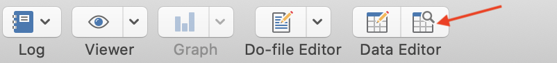
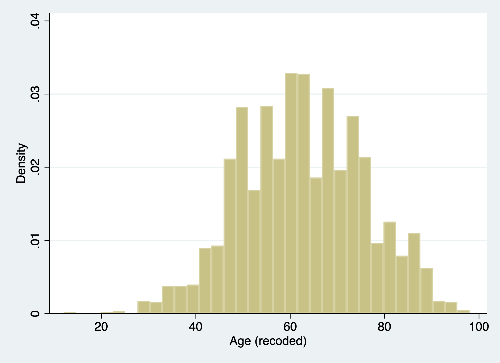
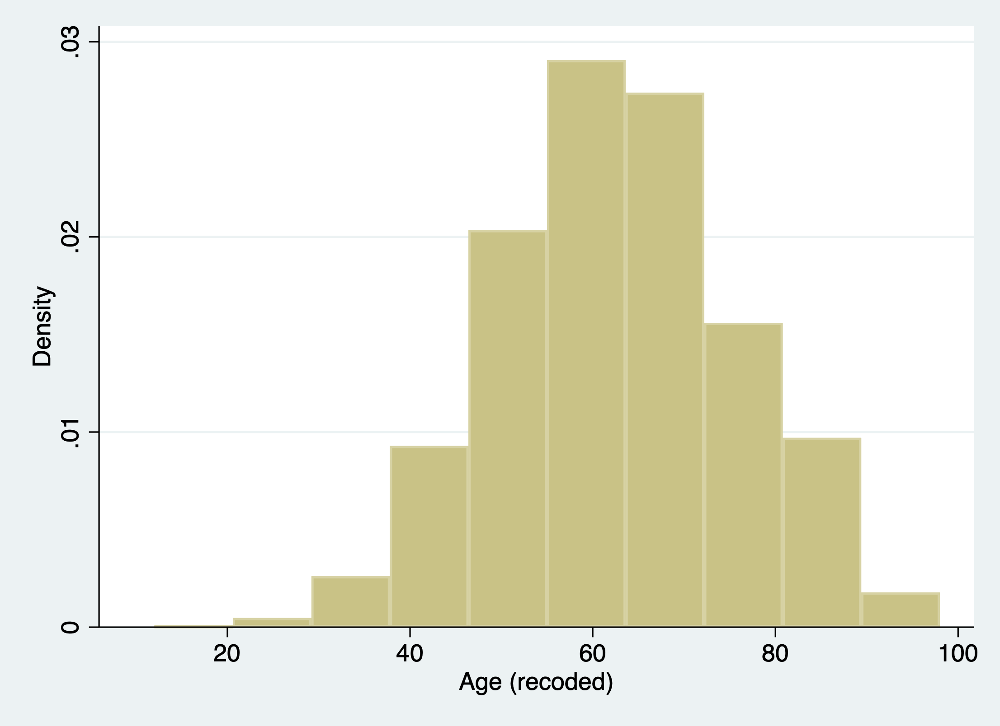
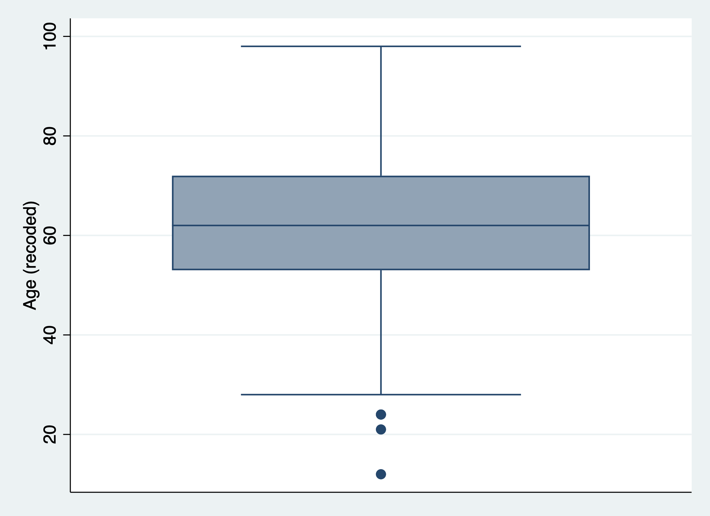
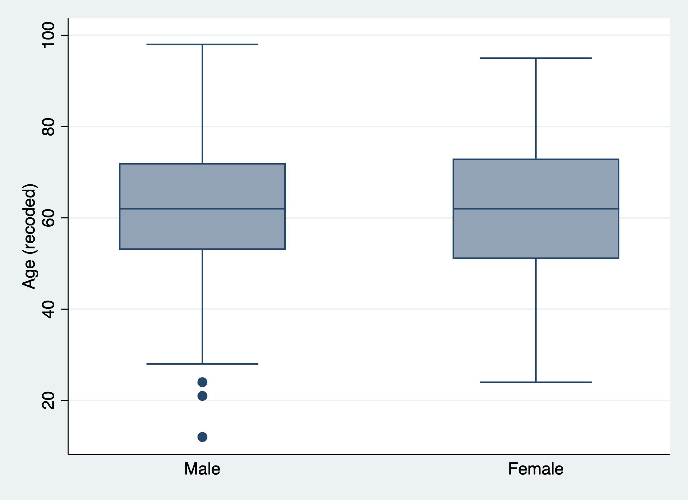
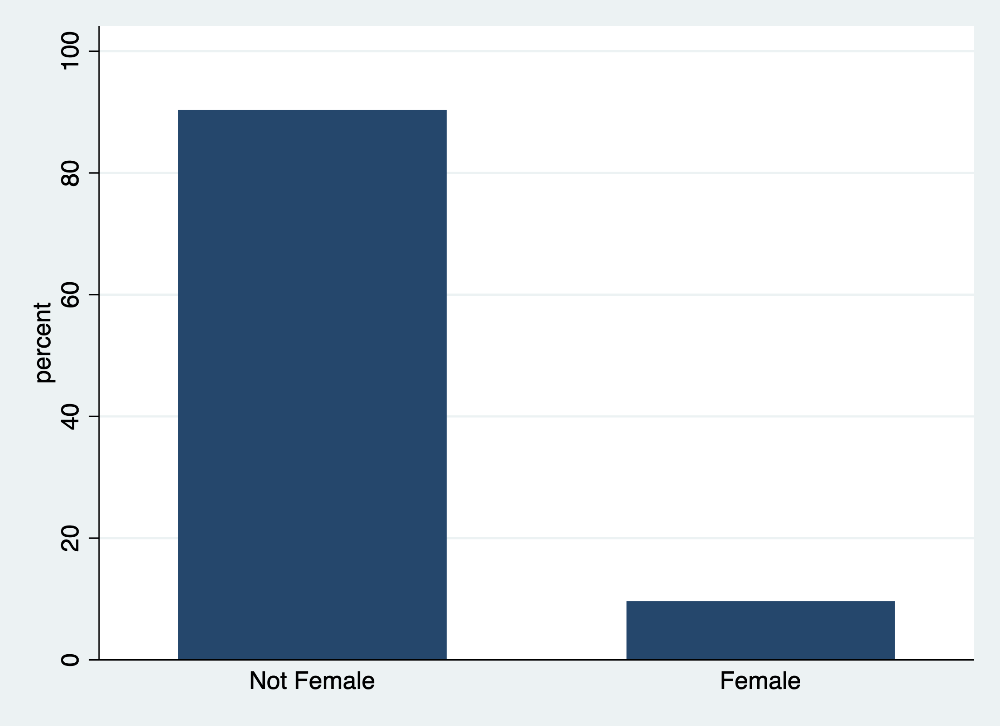
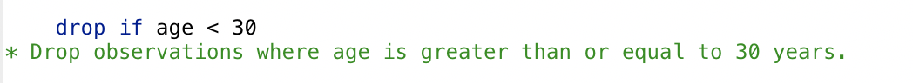
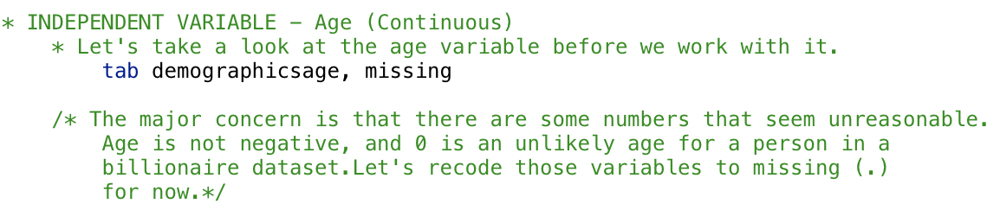

# Lab 1 (Stata)

```{r stata_setup, warning=FALSE, message=FALSE, echo=FALSE}
library(Statamarkdown)
stataexe <- "/Applications/Stata/StataBE.app/Contents/MacOS/StataBE" # Mac OS
knitr::opts_chunk$set(engine.path = list(stata = stataexe))
```


## Lab Goals & Instructions
  
* Review the basics of data cleaning  
* Learn the importance of annotating code
* Start develop your own coding style 
  
**Instructions** 
  
1. Download the data file (`SOC401_W21_Billionaires.dta`) and .do script (`401-1-Lab1.do`) from the links below. 
2. Create a file structure following [the instructions in 2.3 below](#file)
2. Work through the .do script, executing each line of code. This page contains the same material, with more explanation about the functions used. 
3. Read through the Importance of [Annotation and Clean Code](#clean), and complete the short activity at the bottom of the page. Email the .do script file to me by class on Monday.   
  
**Jump Links to Commands in this Lab:**  
[cd (set working directory)](#cd)  
[use (load stata files)](#use)  
[import delimited (load .csv)](#use)  
[describe](#describe)  
[mdesc for missing data](#mdesc)  
[summarize](#summarize)  
[tabulate](#tabulate)  
[generate](#generate)
[recode](#recode)  
[replace](#replace)  
[histogram](#histogram2)  
[graph box (box plot)](#boxplot2)  
[graph bar (bar plot)](#barplot2)  
[keep](#keep)  
[drop](#drop)  
[save](#saving)  
[export delimited](#saving)


 
## Lab Files  

```{r, echo = FALSE}
xfun::embed_file('data_raw/SOC401_W21_Billionaires.dta')
```

```{r, echo = FALSE}
xfun::embed_file('scripts/401-1-Lab1.do')
```

## Create a File Structure {#file}
Life can get messy and so can data analysis. Creating a file structure is the equivalent of keeping a clean work space. You may not mind a messy desk, but a messy file structure will be a nightmare for your collaborators and increase your risk of making mistakes in your analysis. With quantitative data analysis, file management is crucial. I am going to suggest a file structure that you follow in this class. It will ensure that the relative pathways I include in lab script files will run. 
<br> 
<br> 

For your first task, create the following file structure for this class. 
  
1. Decide where on your computer you'd like to store class files. Create a new folder in that spot titled anything you like. Example: 401_Linear_Regression. DO NOT include spaces in your folder title. 
2. Create the following sub-folders in your main folder:  
  
* data_raw
* data_work
* scripts 
* figs_output
  
3. Move `SOC401_W21_Billionaires.dta` to your `data_raw` folder. 
4. Move `401-1-Lab1.do` to your `scripts` folder. 
  
When you begin labs, you should move all raw data files and script files to the appropriate locations. 
<br> 
<br> 

{width=35px} <font size="5"> Data Tip</font>  

> Why do I need two separate folders for data?  
You should aways store your original, raw data files in a place where they are in no danger of being saved over, altered, or lost. One great way of protecting your original data files is to create two folders for data: one folder for your raw files and one folder where you can saved cleaned datasets and subsets. 

## Data Cleaning 

95 percent of the work of quantitative research is getting your data in shape to run your model. This tutorial assumes that you opened Stata and run a few commands before. If you are have not used Stata before, here are some resources to help you get started coding in R.  
  
* [Stata Tutorial from Princeton](https://www.princeton.edu/~otorres/StataTutorial.pdf): A great overview of Stata basics  
* [Stata Tutorial from University of South Australia](https://lo.unisa.edu.au/mod/book/view.php?id=641259)
* [Stata Commands Cheat Sheet](https://www.stata.com/links/resources-for-learning-stata/cheat-sheets/StataCheatsheet_processing_June_2016_TE-REV.pdf)
  
Northwestern's Research Computing Services [offers great trainings in a variety of software languages](https://www.it.northwestern.edu/research/training.html). They do not have regular trainings in Stata, but you can set up individual meetings to help work through problems in your code. Check them out and get on their email list. 

### Set up the environment {- #cd}

**Working Directory**  
Before you get to work cleaning your data, you need to let the software know where to grab and save your files. This saves you from having to type in a long file path anytime you want to do something. You must begin any Stata .do file by setting your working directory. Your working directory is the folder on your computer where you want to store all your data and script files. Below you will see the path to my working directory. You should replace the filepath with the one you want to use. 
```{stata working-directory, results=FALSE, collectcode=TRUE}
cd "/Users/srwerth/Documents/Work_Research/Regression_Labs"
```
  
**Do File Set-up**  
Now that you've set your working directory, you can tell Stata to go grab your data and load it into your working environment. 
<br>
There are a couple lines of code you want to put at the beginning of your .do file to keep your code running smoothly.  
  
* `clear all`: Clears the stata environment before you run your code. 
* `capture log close`: If there's a previous log set up, this code closes it. 
* `log using Lab1.scl, replace`: This creates a new log file, which is a file that tracks all the code you run in the session. This is important for reviewing your analysis after the fact. Rename the file whatever you like for each lab. 
* `version 17`: This command Stata what version of the software you wrote this .do file in, in case you are running
it in a different version later. Sometimes commands can change between versions. This prevents any inconsistencies between versions from causing errors.
```{stata environment, eval=FALSE}
clear all 
capture log close
log using Lab1.smcl, replace
version 17
```


### Load your data {#use} 
Now you are ready to load your data. Loading data that is in Stata's data formats is easy. An Stata data file ends in .dta. Note how I get to use a relative path, just telling Stata to look in the `data_raw` folder, and then the dataset name. 
```{stata data-load, results=FALSE, collectcode=TRUE}
use "data_raw/SOC401_W21_Billionaires.dta"
```

You can also load data in other formats. A CSV file is one of the most common data formats. 
```{stata other-data, eval=FALSE}
import delimited "data_raw/SOC401_W21_Billionaires.csv"
```
Check out this tutorial on how to load excel data:<br>
https://www.stata.com/manuals/dimportexcel.pdf

### Exploring your data {-}
When you begin any new project, it is important to understand the condition of your variables. Here are a few important functions you need to begin that process.  

{width=35px} <font size="5"> Data Tip</font>  

> Remember if this script or any other uses a command that you are not familiar with, you can search for the function online or type 'help' and then the name of the function you want to look up in the command line. For example, 'help describe' will pull up the documentation for that command.   


#### Let's start by taking a global look at your dataset. {- #describe}
The `describe` function provides an overview of your dataset. The output includes the number of observations, variables, and a description of each variable in the dataset. The description includes the format and any labels already attached to each variable. 
```{stata describe}
describe
```
  
You can also look at a specific variable you want to learn more about 
```{stata describe-specific}
describe demographicsgender2
```
  
If you want to look at your data set in a spreadsheet-type format you can look at the Data Editor in browse mode. You can open the Data Editor by clicking on the icon below on the top bar. Make sure you click on the icon with the magnifying glass (browse mode), not the pencil (edit mode). You do not want to accidentally edit your data.  
  
{width=400px}


#### Look at missing observations in your dataset {- #mdesc}
To look at missing values for each variable in your data set we need to download a new function into Stata. The `mdesc` function makes looking at missing values easy. To install a Stata program you can run `search mdesc` in the command line and click the link in the program information to install the program ()
```{stata install, results=FALSE, collectcode=TRUE}
ssc install mdesc
```
  
Now you are ready to look at the missing values in your dataset
```{stata missing}
mdesc
```
  
Or you can look at missing values for a specific variable
```{stata single-missing}
mdesc companyname
```


#### Descriptive statistics for continous variables using `summarize` {- #summarize}
You can generate simple descriptive statistics (mean, standard deviation, range, etc.) with the `summarize` command. Looking at descriptive statistics is not only helpful to get a sense of your data, they can also be helpful checks as you work on cleaning a dataset. 
```{stata summarize1}
summarize demographicsage
```

If you add `, detail` to the command youcan see additional descriptive statistics, 
	including skew, variance and quartiles.
```{stata summarize2}
summarize demographicsage, detail
```

#### Frequency tables for categorical variables using `tabulate` {- #tabulate}
Tabulate produces a frequency table showing how many observations there are for each value. 
```{stata tab1}
tabulate demographicsgender2
```
If you add `, nolabel` it shows you the values without their label. This is how the values appear in the actual data, which is important to know when you have to recode your data. With this example, you can see that female is coded as 1, male is coded as 2, and married couple is coded as 3. 
```{stata tab2}
tabulate demographicsgender2, nolabel
```
If you add `, missing` it will add a row to the table showing the number of missing values for that variable. 
```{stata tab3}
tabulate demographicsgender2, missing
```
**Note:** you can also shorten `tabulate` to `tab` and the function will run the same. 

### Cleaning variables {- #recode}
In the previous section, we learn the code to check the state of a variable when we first open the dataset. Most of the time, you're likely to find that the variable isn't ideal to work with. It is important to use this commands to make a variable ready for your use.  
  
Let's take a closer look at the variable for gender again: 
```{stata look}
tabulate demographicsgender2
```

I notice a few things you will want to change about that variable: 
  
a) The variable name is tedious to type 
b) We want this to be a dummy variable where 1 is female and 0 is not female (in this binary, male). 
c) We have three married couples in our data set coded as 3  
  
Let's create a new variable with a better name and recode it how you'd like it. 

#### `generate` to create new variables {- #generate}
If you want to label the 3 married couples as 0, aka not female, take the following steps. First let's generate a new variable `female` with the same values as `demographicsgender2`. We'll also go ahead and label that variable "Female". 
```{stata gen, collectcode=TRUE, results=FALSE}
gen female = demographicsgender2
label variable female "Female (recoded)"
```

The command is `label variable`, the variable you are labeling is `female`, and the label is "Female". 

#### `recode` to transform the values of a variable {- #recode}
Now let's take our new variable and recode the values so that 0 means "Not Female" and 1 means "Female". In this example, we're taking all the married couples and labeling them as 0. In this code you are telling Stata to recode the variable `female` so that a 3 becomes a 0, a 2 becomes a 0 and a 1 stays a 1. 
```{stata recode, results=FALSE, collectcode=TRUE}
recode female (3 = 0) (2 = 0) (1 = 1) 
```

You should also at this point apply a label to these new values, so your tables and graphs will be easier to read. This is a two step process. First you create an object that stores the labels you want to apply to each value. `label define` is the command and `gender` is the name of the object you are creating. 
```{stata label-object, collectcode=TRUE, results=FALSE}
label define gender 0 "Not Female" 1 "Female"
```
Second, you apply that label object to the variable. `label values` is the command, `female` is the name of the variable you want to label, and `gender` is the label object you want to apply to it. 
```{stata label-attach, collectcode=TRUE, results=FALSE}
label values female gender
```

Let's run a crosstab table to make sure that everything came out right. Looks like everything landed where it is supposed to. 
```{stata crosstab1}
tab female demographicsgender2
```

#### `replace` to transform the values of a variable {- #replace}
There's another way to recode variables. Both options work just as well, so it is truly your preference which one you want to use. We'll practice using the replace command by recoding our gender variable a different way. Let's make a new variable so 0 only refers to "Male" and 1 only refers to "Female". You will recode the married couples to missing.

First, you will generate a new variable, `female2`. In this instance we set all the values of the new variable to missing. We'll also label it. 
```{stata gen2, results=FALSE, collectcode=TRUE}
gen female2 = . 
label variable female2 "Female (Male/Female)"
```

Now let's recode our values using the replace command. This command replaces the values of your variable, based on the values of another variable. Here you are telling Stata to replace the value of `female2` if `demographicsgender2` is equal to 2. On the second line you make the value of `female2` 1 if `demographicsgender` is equal to 1. 
```{stata replace, results=FALSE, collectcode=TRUE}
replace female2 = 0 if demographicsgender2 == 2 
replace female2 = 1 if demographicsgender2 == 1
```
Let's label it as well 
```{stata label2, results=FALSE, collectcode=TRUE}
label define gender2 0 "Male" 1 "Female"
label values female2 gender2
```


Because you set all the values to missing and do not recode the 3 values to anything, they will remain missing. Let's double check with our crosstab using `tabulate`. We'll add `, missing` to see if the 3 values were recoded correctly (and everything looks good). 
```{stata crosstab2}
tab female2 demographicsgender2, missing
```

**Note**: In Stata when you are creating something new, as with the generate, you use a single equals sign. Your new variable `female` *should equal* what follows. When you're writing a test statement referring to something that already exists, you use double equals sign (`==`), as we do in the second part of the replace command. . 

Now let's try another example, looking at the variable for age: 
```{stata look2}
tab demographicsage, missing
```

The major concern is that there are some numbers that seem unreasonable. Age is not negative, and 0 is an unlikely age for a person in a billionaire dataset. Let's recode those variables to missing (.) for now. First we generate a new variable named something simpler and easier to type and label it. 
```{stata gen-age, results=FALSE, collectcode=TRUE}
generate age = demographicsage
label variable age "Age (recoded)"
```

Now you'll use `recode` to set any values 0 or below to missing. 
```{stata age, results=FALSE, collectcode=TRUE}
replace age = . if age <= 0
```

Use `summarize` to check the new range. 
```{stata check1}
summarize age 
```

Use `mdesc` to check the new number of missing values. 385 is equal to all the previous 0, -7, and -42 values. 
```{stata check2}
mdesc age
```


{width=35px} <font size="5"> Data Tip</font>  

> **Why create a new variable when recoding?**  
If you have a sharp eye, you'll notice that we created a new variable rather than changing the name of our original variable and recoding it. Data cleaning is an iterative process. You may make mistakes (you will probably make mistakes) or you may change your mind about how to recode a variable. In each case, having the original variable on hand is always helpful. To preserve your original variable, you create a new variable rather than writing over the old one. 

### Vizualizing variables {-}

#### Continuous Variables {-}
While frequency tables and descriptive statistics are helpful, visualizing continuous variables or discrete variables with a wide range of values can be helpful to get a look at the shape of our data. Histograms or box plots the go to.  
  
  
##### Histograms {- #histogram2}
 
```{stata hist1, eval=FALSE}
histogram age 
```


If you want to change the number of bins (i.e. bars), 
```{stata hist2, eval=FALSE}
histogram age, bins(10)
```


##### Box plots {- #boxplot2}
Let's try making a boxplot of age. 
```{stata box1, eval=FALSE}
graph box age
```


Let's try making a boxplot of age by gender. 
```{stata box2, eval=FALSE}
graph box age, over(female2)
```


#### Categorical Variables {-}
Again frequency tables are great, but sometimes a visualization of a categorical data can better communicate patterns. 
#### Bar plots {- #barplot2}
```{stata bar2, eval=FALSE}
graph bar, over (female)
```


### Subsetting and saving data {-}
Sometimes you'll be working with a huge dataset, and it is easier and cleaner save portion of observations and/or variables in a new dataset. This is called a sub-sample.  

#### Subset your data to specific variables {- #keep}
Let's say you only want to keep the following three variables: year and the two variables you just created: age and female. For this task, you can use the `keep` command. We'll check it with the `describe` command. 

```{stata keep1}
keep year age female2
describe
```

You can also use the `drop` command if you only want to exclude a variable or two. 
```{stata drop, results=FALSE}
drop female2
```

#### Subset your data to specific observations {- #dropif}
But what if you wanted to subset the data to only billionaires 30 or older? For this you can also use the `drop` command with an `if` conditional statement added. We'll check it with `summarize`. 

```{stata dropif}
drop if age < 30 
summarize age 
```

#### Saving your subset {- #saving}
Now that you have your subset, you'll want to save it. Saving in Stata's data, format is simple. You add the `, replace` for when you are rurunning this .do file. If there is already a dataset named `mysubset.dta`, then stata will save over it with your new changes. **Take care** with saving over datasets. The action cannot be undone. 
```{stata save, eval=FALSE}
save "data_work/mysubset.dta", replace
```

There are extra steps to save it other formats. .CSV files, are one of the most common formats you'll receive and save data in outside of Stata. 
```{stata, eval=FALSE}
export delimited using data_work/mysubset.csv, replace 
```

**Remember**, every time you run these command it writes over your previous save. So be careful about version control and **ALWAYS** maintain the raw data file in a separate location.

## The Importance of Annotation and Clean Code 
A do file (aka a script) is not just a functional document where you conduct your analysis. It is also an important record of your analysis. When you read back through your do files you should be able to understand what each step of code is doing and why. Well-written code scripts:  
  
* Have a header with your name and a title or a short description of what the script contains (e.g., "Cleaning data for regression analysis on billionaires")
* Document the analytic decisions made about cleaning and analysis
* Can be run from start to finish without errors
  
You may think that you will remember what you were thinking when you wrote a script, but sometimes you'll have to step away from an analysis for weeks or months. When you come back to it, your notes will remind you exactly why you coded things the way you did. Your code scripts will also be read by other people. It may be collaborators, advisers, or colleagues who agree to quality check your code to look for errors. It is also more and more common for journals to ask scholars to post their coding files so that other people can replicate your analysis.  
  
### How to make notes in your script {-}
The main way to make a note in an Stata .do script is to use the `*` at the beginning of a line.  
  
Let's return to our code to subset our data to billionaires 30 or older. In this code I note above the command what it is about to do. In the second command, I include a note one the same line to remind myself that I want to check to make sure the code I ran worked correctly. 
{width=500px}

You can also use `/* */` to create notes that span across multiple lines. For example: 
{width=500px}
If you want to add a note to the end of a command you can put a double slash `//`
{width=500px}

### Tips for Neat Code {-}
Notes are a huge part of making your code readable to yourself and others. However, writing neat code is also an enormous gift you can give to yourself, to the TA grading your do files, and anyone else trying to make sense of your code. Here are my top tips for writing neat code in Stata:   
  
* Split long functions and commands across multiple lines
* Leave spaces around equals signs and other operators 
* Create headers and sections in your code 
* Create clear names for your variables

#### Split long functions and commands across multiple lines {-}
Nothing, I repeat, nothing makes code harder to read than shoving it all into one long line. It can be a little tricky to split some commands across multiple lines in Stata, but it is possible and makes your code much cleaner. You can do so by adding a triple forward slash to the end of a line (`///`). This tells stata that the command continues on the next line. You can use this over as many lines as you want.  
  
Take this example. Say we wanted to keep many variables in our subset. 

```{stata, eval = FALSE}
keep wealthworthinbillions demographicsage demographicsgender2 wealthhowinherited2 wealthtype2 wealthhowcategory2 locationregion2
```

These lines of code will run just fine, but they are difficult for your eye to parse when squished together. Let your code breathe!  

```{r, eval = FALSE}
keep wealthworthinbillions demographicsage demographicsgender2 ///
  wealthhowinherited2 wealthtype2 wealthhowcategory2 locationregion2
```

As a rule, don't let any line get past about 80 characters. Stata .do files include a 
vertical line at about this point. I recommend that you don't write past it in 
your code scripts. It will help you and the reader avoid the annoying horizontal scroll bar. 

#### Leave spaces around operators {-}
This is another tip to let your code breathe! When coding it is best practice to 
put a space after any comma or logical operator. Take the line of code below: 
```{stata, eval = FALSE}
replace female2=0 if demographicsgender2==2 | demographicsgender2==3
replace female2=1 if demographicsgender2==1
```

It works, but it's cluttered and makes it difficult to read. Take a look at this 
line in a cleaner format: 
```{r, eval = FALSE}
replace female2 = 0 if demographicsgender2 == 2 | demographicsgender2 == 3
replace female2 = 1 if demographicsgender2 == 1
```

Notice how I've added a space on both sides of the equals signs. This makes it easier to understand and edit your code. 

#### Create headers and sections in your code {-}
You wouldn't write a paper without any titles or sections, so don't write your code without titles or sections! Take a look back at the Stata do script for this lab. Notice how I put a section header for setting up your environment, exploring your data, cleaning your data, and so on. Hopefully this made it easier for you to work through the script.  

#### Create clear names for your variables {-}
Everyone has their own preferred naming system for variables and data sets. The golden rule for naming is consistency. For example, if I recode variables I will often add `_rc` to the end for recode (e.g., `age` and `age_rc`). Other tips:  
  
* Make your names explicit, but brief (e.g., `billionaires_over30.dta`)
* Don't include spaces in your file names, it makes file paths difficult

## Activity
For this class, we expect you to write legible, clean code. To kick start this process, I want you to begin develop your own coding style. By class on Monday, email me (`rosewerth@u.northwestern.edu`) a script file for a hypothetical data cleaning script. The script should include:  
  
1) A script header with your name, the date you created the script, and a short description of what the script contains
2) Two section headers 
3) A command to set your working directory to the main folder you created in this lab 
3) A note telling me what you find easy about coding in Stata and what you find difficult about coding in Stata. 
  
This should be your template for writing clean scripts for the rest of the quarter. Your template can evolve, but I expect all your scripts moving forward to contain title and section headers and clear annotation for each step in your code. 
