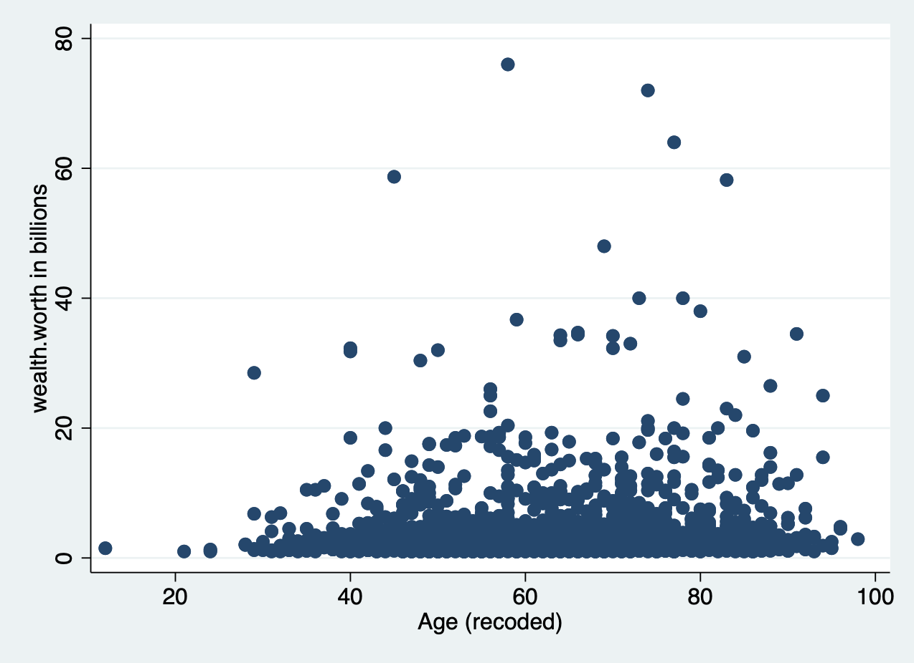
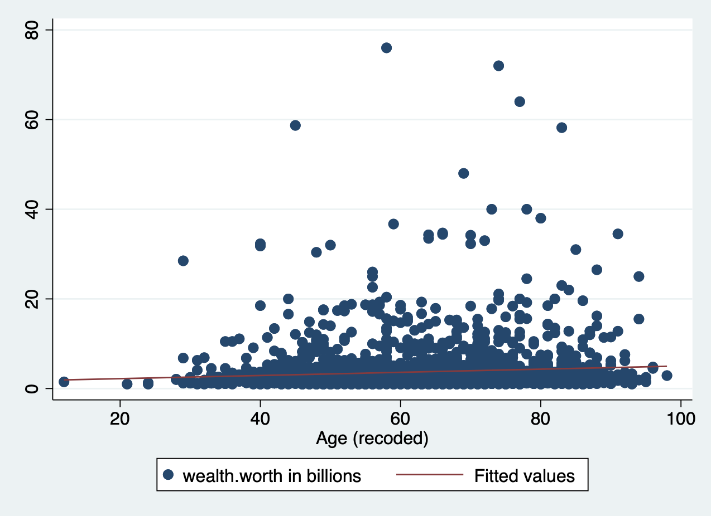
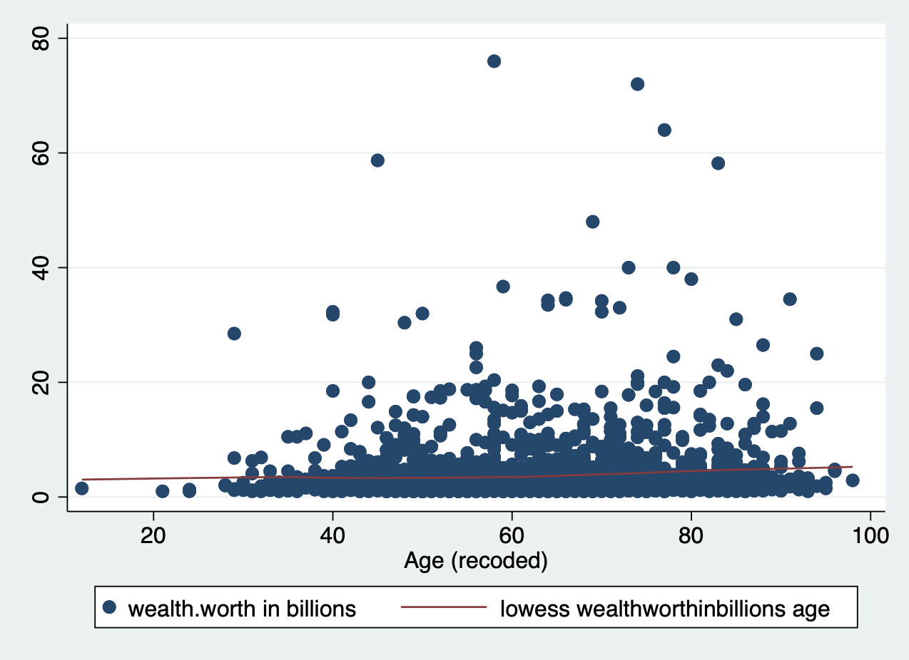

# Lab 2 (Stata)

```{r warning=FALSE, message=FALSE, echo=FALSE}
library(Statamarkdown)
stataexe <- "/Applications/Stata/StataBE.app/Contents/MacOS/StataBE" # Mac OS
knitr::opts_chunk$set(engine.path = list(stata = stataexe))
```


## Lab Goals & Instructions

**Goals**  
  
* Use scatter plots and correlation to assess relationships between two variables
* Run a basic linear regression
* Generate residuals and examine them via plots   

**Research Question**: What features are associated with how wealthy a billionaire is?
<br> 
<br>
**Instructions**  


**Jump Links to Commands in this Lab:**  
[scatter (scatter plot)](#scatter1)
[lfit (line of best fit)](#lfit1)
[loess (lowess line)](#lowess1)
[correlate](#correlate1) 
[pwcorr](#correlate1)


## Lab Files  

```{r, echo = FALSE}
xfun::embed_file('data_raw/SOC401_W21_Billionaires_v2.dta')
```

```{r, echo = FALSE}
xfun::embed_file('scripts/401-1-Lab2.do')
```


## Evaluating Associations Between Variables
In this lab you'll learn a couple ways to look at the relationship or association between two variables before you run a linear regression. In a linear regression, we assume that there is a linear relationship between our independent (x) and dependent (y) variables. To make sure we're not horribly off base in that assumption, after you clean your data you should check the relationship between x and y. We'll look at two ways to do this: scatter plots and correlation. 
<br> 
<br> 
**Note:** I'm not including the code to set up your .do file environment here, but it is included in the .do file for lab 2. 

```{stata, collectcode = TRUE, results=FALSE, echo = FALSE}
cd "/Users/srwerth/Documents/Work_Research/Regression_Labs"
use "data_raw/SOC401_W21_Billionaires_v2.dta"
```

### Scatter Plots {- #scatter1}
A scatter plot simply plots a pair of numbers: (x, y). Here's a simple plot of the point (3, 2). 
<center>
```{r, echo=FALSE, warning=FALSE, message=FALSE, out.width='75%'}
library(ggplot2)

# Create data frame
df <- read.table(header = T, text = "
x   y
3  2")

# Plot
ggplot(df, aes(x, y)) + 
  geom_point(size = 5, color = "red") + 
  xlim(0, 4) +
  ylim(0, 3) +
  theme_minimal() + 
  theme(text = element_text(size=20))
```
</center>
To look at the relationship between our independent and dependent variables, we plot the (x,y) pairings of all our observations. 
<br> 
<br> 
Let's look at the relationship between the two variables of interest in our analysis today: age (x) and wealth (y). You'll produce a basic scatter plot of x and y, which can let you see at a glance whether there is a linear relationship between the two. 
```{stata, eval = FALSE}
scatter wealthworthinbillions age
```
<center>
{width=550px}
<br>
It's pretty difficult to see a pattern here. 
</center>
<br> 
At times, we need extra help to see linear associations. This is especially true whether there are a ton of observations in our data. There may be an association, our eyes just cannot detect it through all the mess. To solve this problem, we add what's called a **line of best fit** (aka a linear regression line) over our graph.  

#### Line of Best Fit {- #lfit1}
When we run a regression, we are generating a linear formula (something like `y = ax + b`). We can plot that line to visually see the relationship between two variables. In Stata, you do this by using `lfit` and add it to the end of your scatter plot command. 
```{stata, eval = FALSE}
scatter wealthworthinbillions age || lfit wealthworthinbillions age
```
<center>
{width=550px}
</center>
There is a slight slope to the line, indicating we may have a significant linear relationship. **However**, Stata will plot a straight line even if the relationship is NOT linear. Take the following example. Here, I've plotted a data set with a parabolic relationship ( $y = x^2$ ) and then plotted a line of best fit. Even though there is a clear relationship, it's a curved relationship, not a linear one. Our line of best fit is misleading. 

<center>
```{r, echo=FALSE, out.width='75%', message=FALSE}
x <- -25:25
y <- x^2

df <- data.frame(x, y)

ggplot(df, aes(x, y)) + 
  geom_point(size = 3, color = "navyblue") +
  geom_smooth(method = "lm", se = FALSE, color = "red") + 
  theme_minimal() + 
  theme(text = element_text(size=20))

```
</center>

So how do we overcome this problem? Rather than assuming a linear relationship, we can instead plot a **'lowess' curve** onto our graph. 

#### Lowess Curve {- #lowess1}
A Lowess (Locally Weighted Scatterplot Smoothing) curve creates a smooth line showing the relationship between your independent and dependent variables. It is sometimes called a Loess curve (there is no difference). Basically, the cuts your data into a bunch of tiny chunks and runs a linear regression on those small pieces. It is weighted in the sense that it accounts for outliers, showing possible curves in the relationship between your two variables. Lowess then combines them all into a smooth line through our scatter plot. [Here is a long, mathematical explanation](https://towardsdatascience.com/loess-373d43b03564) for those of you who are interested. All you need to know is that it plots a line that may or may not be linear, letting you see at a glance if there is a big problem in your linearity assumption. 
<br> 
<br> 
Again, all you have to do is add the `lowess` command to the end of your scatterplot. 
```{stata, eval=FALSE}
scatter wealthworthinbillions age || lowess wealthworthinbillions age
```
<center>
{width=550px}
<br> 
Does this result count as a 'linear' relationship? 
</center>

<br> 

{width=35px} <font size="5"> Research Note</font>  

> Evaluating linearity, as with many aspects of quantitative research, involves subjective interpretation. Sometimes the nonlinearity will jump out at you, and sometimes it won't. You have to think carefully about what does or doesn't count as linear. This is just one method.  

### Correlation {- #correlate1}

Another way to evaluate for a linear relationship is looking at the correlation between your variables. You may or may not remember correlation from your introductory statistics classes. A quick review...
<br> 
<br> 
Correlation refers to the extent to which two variables change together. Does x increase as y increases? Does y decrease as x decreases? If whether or not one variable changes is in no way related to how the other variable changes, there is no correlation. In mathematical terms, the correlation coefficient (the number you are about to calculate) is the covariance divided by the product of the standard deviations. Again, here's a mathematical explanation if you are interested. What you need to know is that the correlation coefficient can tell you *how strong* the relationship between two variables is and *what direction* the relationship is in, positive or negative. Of course, we must always remember that correlation $\neq$ causation. 
<br>
<br> 

There are actually a number of different ways to calculate a correlation (aka. a correlation coefficient) in Stata. <br> 
Option 1: 
```{stata}
correlate wealthworthinbillions age female2
```
Option one `correlate` (very intuitive command) uses "listwise deletion" to deal with missing values. If an observation is missing on ANY of the variables you are correlating it automatically deletes them from the entire correlation matrix. 
<br> 
<br> 
Option 2: 
```{stata}
pwcorr wealthworthinbillions age female2, sig    
```
The command `pwcorr` does a number of things differently. First, it uses "pairwise deletion," meaning it excludes an observation from the correlation calculation of each pair of correlations (i.e., if there are missing values on age, but not the other variables). Second, it allows you to see whether the correlations are statistically significant. The option `sig` above places the p-values on in your correlation table. The option `star (0.05)` below sets the alpha to p = 0.05 and places a star next to the statistically significant values. You can see that the correlation between age and wealth is the only significant correlation. 
```{stata}
pwcorr wealthworthinbillions age female2, star (0.05)
```

Now we know that there is a significant, positive correlation between wealth and age. It's time to run a linear regression.

{width=35px} <font size="5"> Research Note</font>  

> In the future, it is going to be important for you to know whether or not your independent variables are correlated with one another. This is called collinearity, and it can cause all sorts of problems for your analysis. Keep these correlation commands in your toolbelt for the future. 

## Running a Basic Linear Regression 
