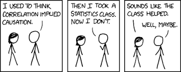

--- 
title: "Linear Regression in Stata and R"
author: "Rose Werth"
date: "Winter 2022"
site: bookdown::bookdown_site
documentclass: book
bibliography: [book.bib, packages.bib]
url: https://bookdown.org/sarahwerth2024/RegressionLabsBook/
cover-image: images/rw.png
description: 
  This website contains lessons and labs to help you code linear regression in
  either Stata or R.
link-citations: yes
---

# Introduction

{width=400px}
 
Source: XKCD

Welcome to your guide to learning linear regression in Stata and R. This website houses all the information you need learn the basics of coding linear regression in Stata and R. It will not contain all the information taught in class, but will allow you to bridge that knowledge into running linear regressions on your own. 
  
  
The Stata labs on this website were adapted from materials by Ewurama Okai. 
  
## Labs 
  
This is a 10-week course with 9 labs. Each lab will focus on some topic related to coding linear regression. By the end of the course, you should be able to run a linear regression project from start to finish with reproducible code.  
  
Each lab will contain links to download script files (in .do or .r format), overviews of key concepts, and application questions. 

### Lab Topics {-} 

**Note:** All lab topics are tentative and subject to change. 
  
* Lab 1: Data cleaning review & writing clean code
* Lab 2: Running a basic linear regression 
* Lab 3: Testing the assumptions of linear regression  
* Lab 4: Transforming variables & displaying results 
* Lab 5: Exporting tables & reproducible code 
* Lab 6: Evaluating linearity 
* Lab 7: Review & requested topics TBD 
* Lab 8: Robust standard errors & multicolinearity 
* Lab 9: Comparing models & running a project from start to finish  
 
## Finding Data
When selecting data, consider:  
  
* The research question you would like to answer
* The model type you will be applying (linear regression in this class)
* The unit/level of analysis in the dataset (individual? school? district? state?)
* The main independent and dependent variables you want to analyze
* Other relevant variables to include in your model
  
  

Some places to find datasets:  
  
* [Inter-university Consortium for Political and Social Research](https://www.icpsr.umich.edu/)
* [National Center for Education Statistics](https://nces.ed.gov/)
* [UNData](https://data.un.org/)
* [World Values Survey](http://www.worldvaluessurvey.org/)
* [General Social Survey](https://gssdataexplorer.norc.org/)
* [Princeton's Office of Population Research Data Archive](https://opr.princeton.edu/archive/)
* [Harvard Dataverse](https://dataverse.harvard.edu/)
* [U.S. Government's Open Data](https://www.data.gov/)
* [Chicago Open Data](https://data.cityofchicago.org/)
* [COVID-19 Open Data Repository](https://health.google.com/covid-19/open-data/)

